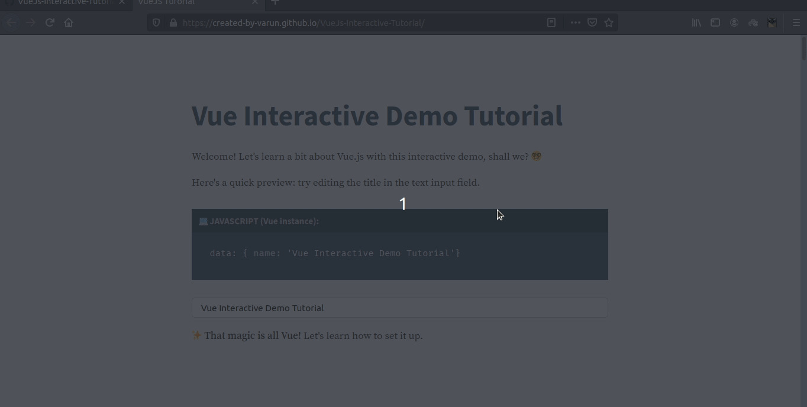
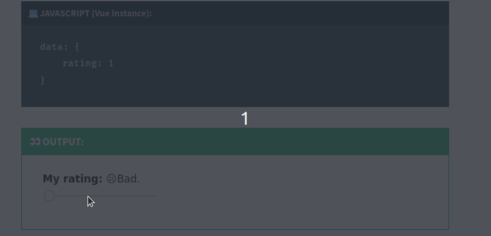

# VueJs-Interactive-Tutorial
An interactive tutorial page made with Vue for Vue learners 
### Click here: [Learn Vue Now!](https://created-by-varun.github.io/VueJs-Interactive-Tutorial/)

## Preview:
  
# 

 

# 

 

# 
  

# 
  

# 
 

